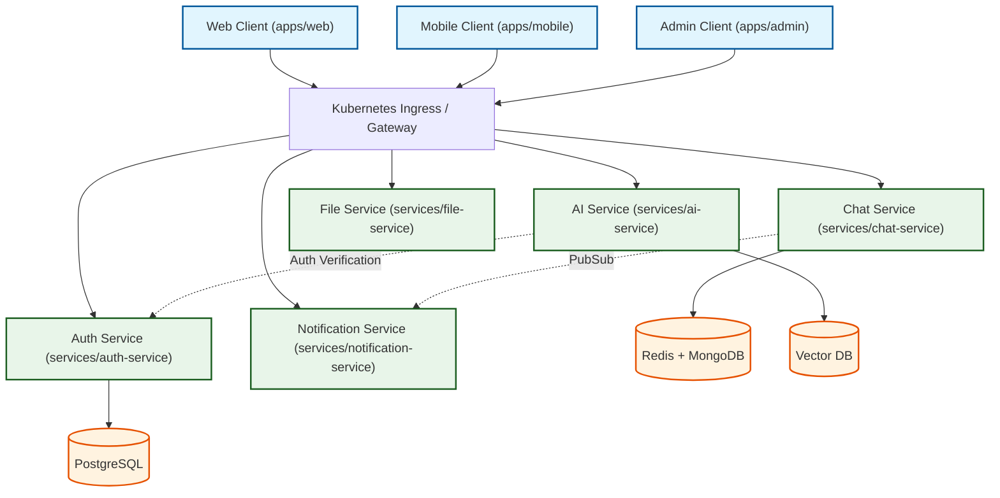

# AstraOS Architecture

This document describes the high-level architecture of the AstraOS ecosystem.

## System Topology

## Communication Patterns

1. **Synchronous Requests (HTTP/REST / gRPC)**: Used for administrative settings, data query processes, and authentication workflows.
2. **Asynchronous Messages (WebSocket / Event Bus)**: Real-time chat streaming, live user status, and notification dispatches.
3. **Monorepo Internal Dependencies**:
   - `packages/ui` is shared across `apps/web` and `apps/admin`.
   - `packages/types` defines all payload validation structures imported by both microservices and frontends.
   - `packages/shared` exports cryptographic and utility functions.
