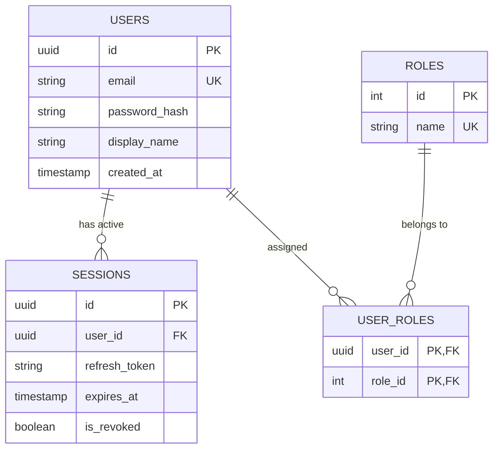

# AstraOS Database Design

This document details the database architecture and entities required to power AstraOS.

## Relational Schema (PostgreSQL)
Used primarily by `services/auth-service` for data integrity and user management.



## Real-time & Messaging Store (MongoDB & Redis)
Used by `services/chat-service` for fast horizontal scalability.

### Collections (`chat_messages`)
```json
{
  "_id": "ObjectId",
  "channel_id": "string",
  "sender_id": "uuid",
  "content": "string",
  "attachments": [
    {
      "file_id": "uuid",
      "url": "string"
    }
  ],
  "created_at": "timestamp"
}
```

### Redis Key Schemas
- **User Presence Status**: `user:presence:{user_id} -> "online" | "away" | "offline"` (TTL: 60s)
- **Active WebSocket Node**: `user:node:{user_id} -> "node-ip-address"`

## Vector Database (Pinecone / Qdrant / pgvector)
Used by `services/ai-service` to search embedding spaces.
- **Namespace**: `docs-knowledge`
- **Metadata Fields**: `{ "owner_id": "uuid", "doc_type": "string", "source_url": "string" }`
